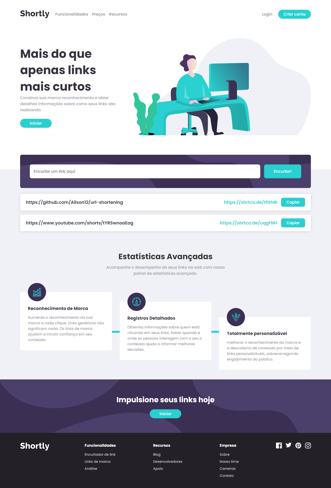

# Shortly

Este projeto é uma solução para o desafio [Shortly URL shorting API](https://www.frontendmentor.io/challenges/url-shortening-api-landing-page-2ce3ob-G). Os desafios do Frontend Mentor ajudam você a melhorar suas habilidades de codificação criando projetos realistas.

## Sumário

- [Visão geral](#visao+geral)
  - [O desafio](#the-challenge)
  - [Captura de tela](#screenshot)
  - [Links](#links)
- [Processo](#my-process)
  - [Construído com](#built-with)
  - [Recursos úteis](#useful-resources)
- [Autor](#author)
- [Agradecimentos](#acknowledgments)

## Visão geral

### O desafio

Os usuários devem ser capazes de:

- Veja o layout ideal para o site, dependendo do tamanho da tela do dispositivo
- Encurte qualquer URL válido
- Veja uma lista de seus links encurtados, mesmo depois de atualizar o navegador
- Copie o link encurtado para a área de transferência com um único clique
- Receba uma mensagem de erro quando o `formulário` for enviado se:
  - O campo `input` está vazio
  - O link já foi encurtado

### Captura de tela



### Links

- URL do site ao vivo: [https://ailson12.github.io/url-shortening/](https://ailson12.github.io/url-shortening/)

## Meu processo

### Construído com

- Marcação HTML5 semântica
- Propriedades personalizadas CSS
- Flexbox
- Grade CSS
- ECMAScript
- OOP

### O que eu aprendi

Hoje em dia existem várias apis úteis disponíveis e ter conhecido a [SHRTCODE](https://shrtco.de/) foi mais uma boa
opção pra ter no portfolio.

```js
  fetchApiShorten(url = '') {
    this.setParamsButton('Carregando...', true)
    fetch(`https://api.shrtco.de/v2/shorten?url=${url}`)
      .then((response) => response.json())
      .then((data) => {
        if (!data.ok) {
          return Promise.reject(data)
        }
        this.addLinkInStorage(data.result)
        this.listStoredLinks()
        this.input.focus()
      })
      .catch((error) => {
        let message = 'Erro ao encurtar link'
        if (error.error_code === INVALID_LINK) {
          message = 'Link inválido'
        }

        console.error(error)
        window.alert(message)
      })
      .finally(() => {
        this.clearValueInput()
        this.setParamsButton('Encurtar!', false)
      })
  }
```

### Desenvolvimento contínuo

Algo que pretendo abordar em outros projetos de uma maneira mais profunda é acessibilidade e medidas de segurança no navegador

## Author

- Website - [Ailson Feitosa](https://github.com/ailson12)
- Instagram - [Ailson Feitosa](https://www.instagram.com/roberto_feitosa06)
